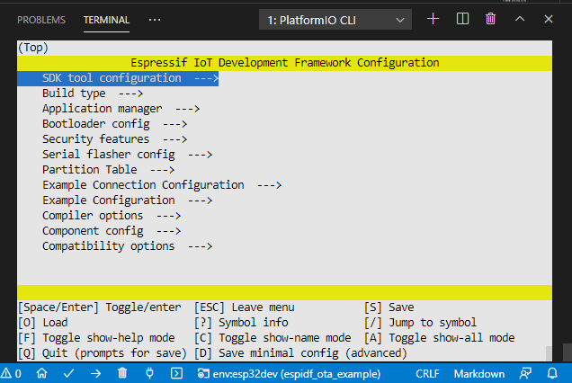

# PlatformIO Example for ESP-IDF OTA over HTTPS Example

## Description 

This is the `simple_ota_example` from [esp-idf](https://github.com/espressif/esp-idf/tree/v4.2/examples/system/ota/simple_ota_example) in a PlatformIO compilable format. Also, the HTTPS server script was adapted to run without dependencies.

Also see https://community.platformio.org/t/esp32-ota-default-examples-dont-work-in-platformio/20866. 

## Configuration

Import the project via PlatformIO Home -> Open Project -> <this repo>. 

Then, [as documented](https://docs.platformio.org/en/latest/frameworks/espidf.html#configuration), open a [CLI](https://docs.platformio.org/en/latest/integration/ide/vscode.html#platformio-core-cli) and execute

```
pio run -t menuconfig
```

to enter the menuconfig tool. Remember the caveat to navigate up/down with the J/K keys.



In there, you'll want to go in to the "Example Connection Configuration" and type in your WiFi SSID and password details.

Further, in the section "Example Configuration", change the "firmware upgrade url endpoint" to the URL where the new firmware `.bin` file should be fetched from. 

As for this example, a script is supplied that opens a HTTPS server locally on the computer on port 8070, so you'll want to change the URL to 

```
https://<your IP here>:8070/hello-world.bin
```

Also, check the "Skip server certificate CN fieldcheck" option, as otherwise the SSL connection doesn't go through (seems mis-configured from the Espressif side..)

The parititon table "partitions_two_ota.csv" should be preconfigured in the "Partition Table" section, but you can double-check.

A `hello-world.bin` example firmware is supplied (that does OTA again). You can change this file to any other you want, e.g. compile an Arduino blink sketch using PlatformIO and use the `.pio\build\<environment>\firmware.bin` file. 

## HTTPS server

Have Python3 preinstalled, then open the terminal program of your operating system (e.g. `cmd.exe`) and execute the Python script without any arguments. 

It should output the local IP address that it's started at and what folder it is serving.

```
>python example_test_no_deps.py
Starting HTTPS server at https://192.168.1.180:8070 serving folder C:\Users\Max\temp\esp-idf\examples\system\ota\simple_ota_example\http_server_root
```

Open the URL in the browser, accept the TLS warning (since it's a self-signed certificate) and you should see a directory listing. The folder that is served is the `http_server_root` folder contained in this project -- all files and folders stored in there will be exposed by the HTTPS server.


This means the HTTPS server is running and if the ESP32 OTA firmware runs, it will try and fetch the `hello-world.bin` (as configured via `menuconfig`) and program itself with it.

## Example output

During one example run, the output should show that the `hello-world.bin` file is being accessed

```
>python example_test_no_deps.py
Starting HTTPS server at https://192.168.1.180:8070 serving folder C:\Users\Max\temp\esp-idf\examples\system\ota\simple_ota_example\http_server_root
192.168.1.162 - - [28/Apr/2021 15:47:54] "GET /hello-world.bin HTTP/1.1" 200 -
```

And the firmware should report the programming, reset and boot into the new firmware.

```
I (5046) simple_ota_example: Starting OTA example
I (7156) esp_https_ota: Starting OTA...
I (7156) esp_https_ota: Writing to partition subtype 16 at offset 0x110000
I (17526) esp_https_ota: Connection closed
I (17526) esp_image: segment 0: paddr=0x00110020 vaddr=0x3f400020 size=0x1f8e4 (129252) map
I (17576) esp_image: segment 1: paddr=0x0012f90c vaddr=0x3ffb0000 size=0x0070c (  1804) 
I (17576) esp_image: segment 2: paddr=0x00130020 vaddr=0x400d0020 size=0x8e604 (583172) map
I (17806) esp_image: segment 3: paddr=0x001be62c vaddr=0x3ffb070c size=0x03168 ( 12648) 
I (17806) esp_image: segment 4: paddr=0x001c179c vaddr=0x40080000 size=0x00404 (  1028) 
I (17816) esp_image: segment 5: paddr=0x001c1ba8 vaddr=0x40080404 size=0x15284 ( 86660) 
I (17856) esp_image: segment 0: paddr=0x00110020 vaddr=0x3f400020 size=0x1f8e4 (129252) map
I (17906) esp_image: segment 1: paddr=0x0012f90c vaddr=0x3ffb0000 size=0x0070c (  1804) 
I (17906) esp_image: segment 2: paddr=0x00130020 vaddr=0x400d0020 size=0x8e604 (583172) map
I (18116) esp_image: segment 3: paddr=0x001be62c vaddr=0x3ffb070c size=0x03168 ( 12648) 
I (18126) esp_image: segment 4: paddr=0x001c179c vaddr=0x40080000 size=0x00404 (  1028) 
I (18126) esp_image: segment 5: paddr=0x001c1ba8 vaddr=0x40080404 size=0x15284 ( 86660) 
I (18186) wifi:state: run -> init (0)
I (18186) wifi:pm stop, total sleep time: 1219859 us / 14696251 us

I (18186) wifi:new:<11,0>, old:<11,0>, ap:<255,255>, sta:<11,0>, prof:1
W (18196) wifi:hmac tx: stop, discard
I (18236) wifi:flush txq
I (18236) wifi:stop sw txq
I (18236) wifi:lmac stop hw txq
I (18236) wifi:Deinit lldesc rx mblock:10
ets Jun  8 2016 00:22:57

rst:0xc (SW_CPU_RESET),boot:0x13 (SPI_FAST_FLASH_BOOT)
```

Once this works you can reflash the original OTA firmware again and exchange the `hello-world.bin` with another file for testing.